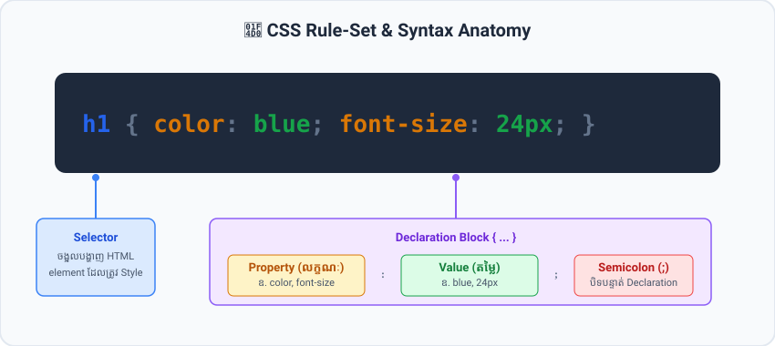

  

<h1 align="center">🎨 រៀន CSS ពេញលេញជាភាសាខ្មែរ (Learn CSS in Khmer - W3Schools Standard)</h1>

  <b>CSS (Cascading Style Sheets)</b> គឺជាភាសាគ្រឹះដ៏មានឥទ្ធិពលបំផុតសម្រាប់កំណត់សោភ័ណភាព ពណ៌ រូបរាង ពុម្ពអក្សរ និងប្លង់ (Layouts &amp; Responsive Design) នៃគេហទំព័រទាំងអស់នៅលើពិភពលោក។

  កម្រងមេរៀននេះត្រូវបានចងក្រងឡើងជា <b>CSS Master Course ស្តង់ដារពេញលេញ</b> (ផ្អែកលើរចនាសម្ព័ន្ធ W3Schools CSS) ដោយបានពន្យល់ទ្រឹស្តីជាភាសាខ្មែរយ៉ាងងាយយល់ ចំៗ រក្សាទុកពាក្យបច្ចេកទេសជាភាសាអង់គ្លេស ១០០% មានកូដគំរូជាក់ស្តែងអាច Run បានភ្លាមៗ រូបភាព SVG Diagrams ពន្យល់ក្បោះក្បាយ លំហាត់អនុវត្ត និង Capstone Projects។

---

## 🎭 ទំនាក់ទំនងរវាង HTML, CSS និង JavaScript (The Trio Analogy)

  

* 🦴 **HTML (The Skeleton - គ្រោងឆ្អឹង):** សាងសង់រចនាសម្ព័ន្ធគ្រោងឆ្អឹង និងមាតិកា (Headings, Paragraphs, Buttons, Forms, Tables)។
* 👕 **CSS (The Skin & Clothes - ស្បែក និងសម្លៀកបំពាក់):** កំណត់ពណ៌ ស្ទីល រូបរាង ប្លង់ គម្លាត និងចលនា (Colors, Layouts, Flexbox, Grid, Animations)។
* 🧠 **JavaScript (The Brain & Nerves - ខួរក្បាល និងប្រព័ន្ធប្រសាទ):** បញ្ជាចលនា Logic និងអន្តរកម្មឆ្លើយតប (Interactivity, Events, Data APIs)។

---

## 🎨 រូបភាព និងដ្យាក្រាមពន្យល់ក្នុងមេរៀន (Visual SVG Diagrams)

កម្រងមេរៀននេះមានបង្កប់ **SVG Vector Diagrams គុណភាពខ្ពស់** នៅគ្រប់មេរៀនស្នូល៖

| # | រូបភាពដ្យាក្រាម (Diagram Topic) | មេរៀនដែលបានបង្កប់ (Embedded Lesson) |
| :---: | :--- | :--- |
| 01 | 📐 **CSS Rule-Set & Syntax Anatomy** | [01-introduction.md](lessons/01-introduction.md), [02-syntax-and-selectors.md](lessons/02-syntax-and-selectors.md) |
| 02 | 📦 **CSS Box Model Architecture** | [11-box-model.md](lessons/11-box-model.md), [09-padding.md](lessons/09-padding.md) |
| 03 | 💥 **CSS Vertical Margin Collapse Mechanism** | [08-margins.md](lessons/08-margins.md) |
| 04 | 🎭 **CSS Display Modes Comparison (block, inline, inline-block, none)** | [19-display.md](lessons/19-display.md) |
| 05 | 📍 **CSS Positioning Types Comparison** | [21-position.md](lessons/21-position.md) |
| 06 | 🥞 **CSS Z-Index & 3D Stacking Context** | [21-position.md](lessons/21-position.md) |
| 07 | 📏 **CSS Units Master Guide (px, rem, em, %, vw, vh)** | [36-units.md](lessons/36-units.md) |
| 08 | ⚖️ **CSS Specificity Hierarchy & Weight** | [37-specificity-and-cascade.md](lessons/37-specificity-and-cascade.md) |
| 09 | 🌊 **CSS Cascade Resolution Flow** | [03-how-to-add-css.md](lessons/03-how-to-add-css.md), [37-specificity-and-cascade.md](lessons/37-specificity-and-cascade.md) |
| 10 | ⚡ **CSS Flexbox Axes & Alignment** | [39-flexbox-container.md](lessons/39-flexbox-container.md), [40-flexbox-items.md](lessons/40-flexbox-items.md) |
| 11 | 🪟 **CSS Grid Tracks, Lines & Areas** | [42-grid-container.md](lessons/42-grid-container.md), [43-grid-items.md](lessons/43-grid-items.md) |
| 12 | 📱 **RWD Breakpoints & Mobile-First** | [45-rwd-viewport.md](lessons/45-rwd-viewport.md), [46-rwd-media-queries.md](lessons/46-rwd-media-queries.md) |
| 13 | 🧊 **CSS 3D Coordinate Space & Transforms** | [53-3d-transforms.md](lessons/53-3d-transforms.md) |
| 14 | ✨ **Glassmorphism 4-Layer Architecture** | [58-glassmorphism.md](lessons/58-glassmorphism.md) |

---

## 🖼️ កម្រងរូបភាពពិតសម្រាប់អនុវត្ត (Real Local Image Assets)

ដើម្បីកុំឱ្យមានបញ្ហារូបភាពខូចពេលគ្មានអ៊ីនធឺណិត (Offline) ឬពេល Link ខាងក្រៅផុតសុពលភាព រូបភាពទាំងអស់ត្រូវបានទាញយក និងរក្សាទុកក្នុង `assets/images/` យ៉ាងត្រឹមត្រូវ៖

| ប្រភេទរូបភាព (Category) | ឈ្មោះ File (Filename) | មេរៀន/គម្រោងដែលប្រើប្រាស់ (Used In) |
| :--- | :--- | :--- |
| 🧑‍💻 **Avatars** | `avatar-instructor.jpg`, `avatar-user.jpg` | [Exercise 1](exercises/exercise-01-profile-card.md), [Portfolio Project](projects/01-modern-personal-portfolio/) |
| 🏞️ **Landscapes / Nature** | `hero-bg-nature.jpg`, `gallery-forest.jpg`, `gallery-mountain.jpg`, `gallery-beach.jpg` | [06-backgrounds.md](lessons/06-backgrounds.md), [32-image-gallery.md](lessons/32-image-gallery.md), [47-rwd-images-and-media.md](lessons/47-rwd-images-and-media.md) |
| 💻 **Tech & Products** | `hero-bg-tech.jpg`, `article-tech.jpg`, `product-laptop.jpg`, `product-phone.jpg`, `product-watch.jpg` | [23-float-and-clear.md](lessons/23-float-and-clear.md), [44-grid-advanced.md](lessons/44-grid-advanced.md), [57-filter-effects.md](lessons/57-filter-effects.md) |
| 🚀 **Portfolio Projects** | `project-store.jpg`, `project-crypto.jpg` | [Portfolio Project](projects/01-modern-personal-portfolio/) |
| 🏢 **Brand / Logo** | `brand-partner.png` | [57-filter-effects.md](lessons/57-filter-effects.md) |

---

## 📚 មាតិកាមេរៀនទាំងអស់ (Table of Contents - 60 Lessons)

### 🔹 Module 1: CSS Core Foundation (មូលដ្ឋានគ្រឹះ CSS)

| ល.រ | មេរៀន (Lesson Title) | ឯកសារមេរៀន (Lesson File) | កូដគំរូ (Demo Code) |
| :---: | :--- | :---: | :---: |
| **01** | សេចក្តីណែនាំអំពី CSS (CSS Introduction) | [01-introduction.md](lessons/01-introduction.md) | [01-css-basics.html](demos/01-css-basics.html) |
| **02** | ទម្រង់កូដ និង Selectors មូលដ្ឋាន (CSS Syntax & Selectors) | [02-syntax-and-selectors.md](lessons/02-syntax-and-selectors.md) | [01-css-basics.html](demos/01-css-basics.html) |
| **03** | របៀបភ្ជាប់ CSS ទៅកាន់ HTML (How to Add CSS) | [03-how-to-add-css.md](lessons/03-how-to-add-css.md) | [01-css-basics.html](demos/01-css-basics.html) |
| **04** | ការដាក់ចំណាំក្នុង CSS (CSS Comments) | [04-comments.md](lessons/04-comments.md) | - |
| **05** | ការប្រើប្រាស់ពណ៌ក្នុង CSS (CSS Colors: HEX, RGB, HSL) | [05-colors.md](lessons/05-colors.md) | [01-css-basics.html](demos/01-css-basics.html) |
| **06** | ផ្ទៃខាងក្រោយ (CSS Backgrounds) | [06-backgrounds.md](lessons/06-backgrounds.md) | [01-css-basics.html](demos/01-css-basics.html) |
| **07** | បន្ទាត់ព្រំដែន (CSS Borders & Rounded Corners) | [07-borders.md](lessons/07-borders.md) | [01-css-basics.html](demos/01-css-basics.html) |
| **08** | គម្លាតខាងក្រៅ (CSS Margins & Margin Collapse) | [08-margins.md](lessons/08-margins.md) | [01-css-basics.html](demos/01-css-basics.html) |
| **09** | គម្លាតខាងក្នុង (CSS Padding) | [09-padding.md](lessons/09-padding.md) | [01-css-basics.html](demos/01-css-basics.html) |
| **10** | កម្ពស់ និងទទឹង (CSS Height, Width & Max-Width) | [10-height-and-width.md](lessons/10-height-and-width.md) | [01-css-basics.html](demos/01-css-basics.html) |
| **11** | គំរូប្រអប់ (CSS Box Model: content-box vs border-box) | [11-box-model.md](lessons/11-box-model.md) | [01-css-basics.html](demos/01-css-basics.html) |
| **12** | បន្ទាត់ស៊ុមក្រៅ (CSS Outline) | [12-outline.md](lessons/12-outline.md) | - |
| **13** | ការកំណត់ទម្រង់អត្ថបទ (CSS Text Formatting) | [13-text.md](lessons/13-text.md) | [02-typography-and-buttons.html](demos/02-typography-and-buttons.html) |
| **14** | ពុម្ពអក្សរ (CSS Fonts & Google Fonts Integration) | [14-fonts.md](lessons/14-fonts.md) | [02-typography-and-buttons.html](demos/02-typography-and-buttons.html) |
| **15** | ការប្រើប្រាស់ Icons (CSS Icons & SVG) | [15-icons.md](lessons/15-icons.md) | [02-typography-and-buttons.html](demos/02-typography-and-buttons.html) |
| **16** | ការកំណត់ Style លើ Link (CSS Links & Button States) | [16-links.md](lessons/16-links.md) | [02-typography-and-buttons.html](demos/02-typography-and-buttons.html) |
| **17** | ការកំណត់ Style លើបញ្ជី (CSS Lists) | [17-lists.md](lessons/17-lists.md) | - |
| **18** | ការកំណត់ Style លើតារាង (CSS Tables) | [18-tables.md](lessons/18-tables.md) | [02-typography-and-buttons.html](demos/02-typography-and-buttons.html) |

---

### 🔹 Module 2: CSS Layout & Positioning (ការរៀបចំប្លង់ និងទីតាំង)

| ល.រ | មេរៀន (Lesson Title) | ឯកសារមេរៀន (Lesson File) | កូដគំរូ (Demo Code) |
| :---: | :--- | :---: | :---: |
| **19** | លក្ខណៈបង្ហាញ Display (block, inline, inline-block, none) | [19-display.md](lessons/19-display.md) | [03-positioning-and-floats.html](demos/03-positioning-and-floats.html) |
| **20** | ការប្រើប្រាស់ Max-Width សម្រាប់ Container | [20-max-width.md](lessons/20-max-width.md) | [03-positioning-and-floats.html](demos/03-positioning-and-floats.html) |
| **21** | ទីតាំងនៃ Element (CSS Position & Z-Index) | [21-position.md](lessons/21-position.md) | [03-positioning-and-floats.html](demos/03-positioning-and-floats.html) |
| **22** | ការគ្រប់គ្រងមាតិកាហៀរចេញ (CSS Overflow) | [22-overflow.md](lessons/22-overflow.md) | [03-positioning-and-floats.html](demos/03-positioning-and-floats.html) |
| **23** | ការបណ្តែតធាតុ (CSS Float, Clear & Clearfix Hack) | [23-float-and-clear.md](lessons/23-float-and-clear.md) | [03-positioning-and-floats.html](demos/03-positioning-and-floats.html) |
| **24** | ធាតុប្លង់ Inline-Block (CSS Inline-Block Layout) | [24-inline-block.md](lessons/24-inline-block.md) | [03-positioning-and-floats.html](demos/03-positioning-and-floats.html) |
| **25** | ការតម្រឹមធាតុចំកណ្តាល (CSS Horizontal & Vertical Alignment) | [25-align.md](lessons/25-align.md) | [03-positioning-and-floats.html](demos/03-positioning-and-floats.html) |
| **26** | ការផ្គុំ Selectors (CSS Combinators) | [26-combinators.md](lessons/26-combinators.md) | - |
| **27** | ស្លាកក្លែងក្លាយ (CSS Pseudo-classes: :hover, :nth-child) | [27-pseudo-classes.md](lessons/27-pseudo-classes.md) | [02-typography-and-buttons.html](demos/02-typography-and-buttons.html) |
| **28** | ធាតុក្លែងក្លាយ (CSS Pseudo-elements: ::before, ::after) | [28-pseudo-elements.md](lessons/28-pseudo-elements.md) | [02-typography-and-buttons.html](demos/02-typography-and-buttons.html) |
| **29** | កម្រិតថ្លា និងភាពស្រអាប់ (CSS Opacity & Transparency) | [29-opacity.md](lessons/29-opacity.md) | - |
| **30** | របារបញ្ជា និងមីនុយ (CSS Navigation Bars) | [30-navigation-bars.md](lessons/30-navigation-bars.md) | [06-responsive-landing-page.html](demos/06-responsive-landing-page.html) |
| **31** | មីនុយទម្លាក់ចុះ (CSS Dropdowns) | [31-dropdowns.md](lessons/31-dropdowns.md) | [06-responsive-landing-page.html](demos/06-responsive-landing-page.html) |
| **32** | វិចិត្រសាលរូបភាព និង Image Sprites | [32-image-gallery.md](lessons/32-image-gallery.md) | - |
| **33** | ជម្រើសតាមលក្ខណៈសម្បត្តិ (CSS Attribute Selectors) | [33-attribute-selectors.md](lessons/33-attribute-selectors.md) | - |
| **34** | ការកំណត់ Style លើ Forms & Inputs | [34-forms-styling.md](lessons/34-forms-styling.md) | [06-responsive-landing-page.html](demos/06-responsive-landing-page.html) |
| **35** | ការរាប់លេខស្វ័យប្រវត្តិ (CSS Counters) | [35-counters.md](lessons/35-counters.md) | - |
| **36** | ខ្នាតរង្វាស់ក្នុង CSS (CSS Units: px, rem, em, %, vw, vh) | [36-units.md](lessons/36-units.md) | [01-css-basics.html](demos/01-css-basics.html) |
| **37** | ទម្ងន់ និងលំដាប់អានុភាព (CSS Specificity & The Cascade) | [37-specificity-and-cascade.md](lessons/37-specificity-and-cascade.md) | - |
| **38** | មុខងារគណនាក្នុង CSS (CSS Math Functions: calc, min, max, clamp) | [38-math-functions.md](lessons/38-math-functions.md) | [06-responsive-landing-page.html](demos/06-responsive-landing-page.html) |

---

### 🔹 Module 3: Modern Layouts - Flexbox & Grid (ប្លង់ទំនើប)

| ល.រ | មេរៀន (Lesson Title) | ឯកសារមេរៀន (Lesson File) | កូដគំរូ (Demo Code) |
| :---: | :--- | :---: | :---: |
| **39** | Flexbox: Container Properties | [39-flexbox-container.md](lessons/39-flexbox-container.md) | [04-flexbox-layouts.html](demos/04-flexbox-layouts.html) |
| **40** | Flexbox: Item Properties | [40-flexbox-items.md](lessons/40-flexbox-items.md) | [04-flexbox-layouts.html](demos/04-flexbox-layouts.html) |
| **41** | Flexbox: Real-World Responsive Layouts | [41-flexbox-responsive.md](lessons/41-flexbox-responsive.md) | [04-flexbox-layouts.html](demos/04-flexbox-layouts.html) |
| **42** | Grid: Container Properties | [42-grid-container.md](lessons/42-grid-container.md) | [05-grid-system-dashboard.html](demos/05-grid-system-dashboard.html) |
| **43** | Grid: Item Properties | [43-grid-items.md](lessons/43-grid-items.md) | [05-grid-system-dashboard.html](demos/05-grid-system-dashboard.html) |
| **44** | Grid: Advanced Patterns & Auto Layouts | [44-grid-advanced.md](lessons/44-grid-advanced.md) | [05-grid-system-dashboard.html](demos/05-grid-system-dashboard.html) |

---

### 🔹 Module 4: Responsive Web Design - RWD (ការរចនាឆ្លើយតបគ្រប់ឧបករណ៍)

| ល.រ | មេរៀន (Lesson Title) | ឯកសារមេរៀន (Lesson File) | កូដគំរូ (Demo Code) |
| :---: | :--- | :---: | :---: |
| **45** | RWD: Viewport Meta Tag & Fluid Layouts | [45-rwd-viewport.md](lessons/45-rwd-viewport.md) | [06-responsive-landing-page.html](demos/06-responsive-landing-page.html) |
| **46** | RWD: Media Queries (@media & Breakpoints) | [46-rwd-media-queries.md](lessons/46-rwd-media-queries.md) | [06-responsive-landing-page.html](demos/06-responsive-landing-page.html) |
| **47** | RWD: Responsive Images & Videos | [47-rwd-images-and-media.md](lessons/47-rwd-images-and-media.md) | [06-responsive-landing-page.html](demos/06-responsive-landing-page.html) |
| **48** | RWD: Mobile-First Strategy & Best Practices | [48-rwd-mobile-first.md](lessons/48-rwd-mobile-first.md) | [06-responsive-landing-page.html](demos/06-responsive-landing-page.html) |

---

### 🔹 Module 5: Advanced Effects, Transforms & Animations (ចលនា និងផលប៉ះពាល់ទំនើប)

| ល.រ | មេរៀន (Lesson Title) | ឯកសារមេរៀន (Lesson File) | កូដគំរូ (Demo Code) |
| :---: | :--- | :---: | :---: |
| **49** | ស្រមោល និងជ្រុងមូល (Rounded Corners & Box Shadows) | [49-shadows-and-rounded.md](lessons/49-shadows-and-rounded.md) | [07-modern-animations-and-glassmorphism.html](demos/07-modern-animations-and-glassmorphism.html) |
| **50** | ផលប៉ះពាល់អក្សរ (CSS Text Effects & Text Overflow) | [50-text-effects.md](lessons/50-text-effects.md) | [07-modern-animations-and-glassmorphism.html](demos/07-modern-animations-and-glassmorphism.html) |
| **51** | ការទាញយក Web Fonts ផ្ទាល់ខ្លួន (@font-face) | [51-web-fonts.md](lessons/51-web-fonts.md) | - |
| **52** | ការបំប្លែងរូបរាង 2D (CSS 2D Transforms) | [52-2d-transforms.md](lessons/52-2d-transforms.md) | [07-modern-animations-and-glassmorphism.html](demos/07-modern-animations-and-glassmorphism.html) |
| **53** | ការបំប្លែងរូបរាង 3D (CSS 3D Transforms & Card Flip) | [53-3d-transforms.md](lessons/53-3d-transforms.md) | [07-modern-animations-and-glassmorphism.html](demos/07-modern-animations-and-glassmorphism.html) |
| **54** | ការផ្លាស់ប្តូរដោយរលូន (CSS Transitions) | [54-transitions.md](lessons/54-transitions.md) | [07-modern-animations-and-glassmorphism.html](demos/07-modern-animations-and-glassmorphism.html) |
| **55** | ចលនា Keyframes (CSS Animations & @keyframes) | [55-animations.md](lessons/55-animations.md) | [07-modern-animations-and-glassmorphism.html](demos/07-modern-animations-and-glassmorphism.html) |
| **56** | Tooltips & Modal Popup បែប Pure CSS | [56-tooltips-and-modals.md](lessons/56-tooltips-and-modals.md) | [07-modern-animations-and-glassmorphism.html](demos/07-modern-animations-and-glassmorphism.html) |
| **57** | តម្រងរូបភាព (CSS Filter Effects) | [57-filter-effects.md](lessons/57-filter-effects.md) | [07-modern-animations-and-glassmorphism.html](demos/07-modern-animations-and-glassmorphism.html) |
| **58** | Glassmorphism & Frosted Glass Effect | [58-glassmorphism.md](lessons/58-glassmorphism.md) | [07-modern-animations-and-glassmorphism.html](demos/07-modern-animations-and-glassmorphism.html) |

---

### 🔹 Module 6: Modern CSS & Architecture (ស្ថាបត្យកម្ម CSS ទំនើប)

| ល.រ | មេរៀន (Lesson Title) | ឯកសារមេរៀន (Lesson File) | កូដគំរូ (Demo Code) |
| :---: | :--- | :---: | :---: |
| **59** | អថេរក្នុង CSS (CSS Variables & Dark Mode Toggle) | [59-css-variables.md](lessons/59-css-variables.md) | [07-modern-animations-and-glassmorphism.html](demos/07-modern-animations-and-glassmorphism.html) |
| **60** | មុខងារទំនើបៗនៃ Modern CSS (:has, Container Queries) | [60-modern-features.md](lessons/60-modern-features.md) | [07-modern-animations-and-glassmorphism.html](demos/07-modern-animations-and-glassmorphism.html) |

---

## 🎯 Capstone Projects & Exercises

* 💻 **Project 1:** [Modern Personal Portfolio](projects/01-modern-personal-portfolio) (Flexbox + Grid + Animations)
* 💳 **Project 2:** [SaaS Pricing & Landing Page](projects/02-saas-pricing-and-landing-page) (Mobile-First + Glassmorphism)
* 📊 **Project 3:** [Admin Dashboard Layout](projects/03-admin-dashboard-layout) (CSS Grid + Dark Mode Theme with Variables)
