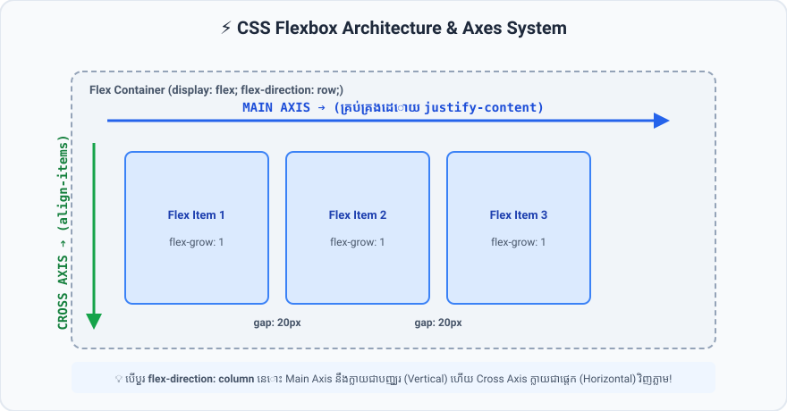

# មេរៀនទី ៣៩៖ Flexbox: Container Properties (CSS Flexbox Container)

> **CSS Flexbox (Flexible Box Layout) គឺជាប្រព័ន្ធរៀបចំប្លង់ ១ វិមាត្រ (1-Dimensional Layout Model) ដែលមានឥទ្ធិពលបំផុតក្នុងការតម្រឹម និងបែងចែកលំហរវាង Elements។**

---

## 🎯 គោលបំណងមេរៀន (What You Will Learn)
* យល់ដឹងពីប្រព័ន្ធអ័ក្ស **Main Axis** និង **Cross Axis** របស់ Flexbox
* ចេះប្រើប្រាស់ Container Properties សំខាន់ៗ៖ `display: flex`, `flex-direction`, `flex-wrap`
* ចេះតម្រឹមកូនៗតាមរយៈ `justify-content`, `align-items`, `gap`

---

## ⚡ ប្រព័ន្ធអ័ក្ស Flexbox Axes System

<p align="center">
  
</p>

* **Main Axis (អ័ក្សចម្បង):** តាមលំនាំដើមរត់តាម **ជួរដេកផ្ដេក (Horizontal ➔)**។ គ្រប់គ្រងដោយ `justify-content`។
* **Cross Axis (អ័ក្សកាត់):** រត់កាត់កែង Main Axis តាម **ជួរឈរបញ្ឈរ (Vertical ↓)**។ គ្រប់គ្រងដោយ `align-items`។

---

## 🎛️ បណ្តា Container Properties ទាំង ៧

### ១. `display: flex` (បើកដំណើរការ Flexbox)
```css
.container {
  display: flex; /* កូនៗទាំងអស់នឹងរត់តម្រៀបជាជួរដេកភ្លាមៗ */
}
```

---

### ២. `flex-direction` (ទិសដៅអ័ក្ស Main Axis)
* `row` (Default): ពីឆ្វេងទៅស្តាំ (ផ្ដេក)
* `row-reverse`: ពីស្តាំទៅឆ្វេង
* `column`: ពីលើចុះក្រោម (បញ្ឈរ) ➔ *Main Axis ក្លាយជាបញ្ឈរ*
* `column-reverse`: ពីក្រោមឡើងលើ

---

### ៣. `flex-wrap` (ការធ្លាក់បន្ទាត់)
* `nowrap` (Default): បង្ខំកូនៗទាំងអស់ឱ្យនៅជួរតែមួយ (រួញតូចបើចង្អៀត)
* `wrap`: អនុញ្ញាតឱ្យកូនៗ **ធ្លាក់ចុះបន្ទាត់ថ្មី** ប្រសិនបើអស់កន្លែង

```css
.card-grid {
  display: flex;
  flex-wrap: wrap; /* ចាំបាច់សម្រាប់ Responsive Card Grid */
}
```

---

### ៤. `justify-content` (តម្រឹមតាម Main Axis - ផ្ដេក)
* `flex-start` (Default): ផ្ដុំនៅដើមបន្ទាត់ (ឆ្វេង)
* `flex-end`: ផ្ដុំនៅចុងបន្ទាត់ (ស្តាំ)
* `center`: តម្រឹមចំកណ្តាលផ្ដេក
* `space-between`: ដាក់គម្លាតស្មើគ្នាចន្លោះកូនៗ ដោយកូនក្បាល និងចុងនៅជាប់គែម
* `space-around`: ដាក់គម្លាតស្មើគ្នានៅជុំវិញកូននីមួយៗ
* `space-evenly`: គម្លាតស្មើគ្នាទាំងសងខាង និងចន្លោះកណ្តាល

---

### ៥. `align-items` (តម្រឹមតាម Cross Axis - បញ្ឈរ)
* `stretch` (Default): ពង្រីកកម្ពស់កូនៗឱ្យស្មើកម្ពស់ Parent
* `center`: តម្រឹមចំកណ្តាលបញ្ឈរ
* `flex-start`: តម្រឹមនៅកំពូលលើ
* `flex-end`: តម្រឹមនៅបាតក្រោម
* `baseline`: តម្រឹមតាមបាតបន្ទាត់អក្សរ (Text baseline)

---

### ៦. `gap` (គម្លាតចន្លោះកូនៗ - ពេញនិយមបំផុត ⭐)
ជំនួសឱ្យការប្រើ `margin` លើកូនៗ យើងគ្រាន់តែកំណត់ `gap` លើ Parent Container តែមួយគត់៖

```css
.container {
  display: flex;
  gap: 20px;       /* ទាំង Row និង Column gap */
  row-gap: 30px;   /* គម្លាតជួរដេក */
  column-gap: 15px;/* គម្លាតជួរឈរ */
}
```

---

## 💻 ឧទាហរណ៍កូដជាក់ស្តែង (HTML + CSS)

```html
<!DOCTYPE html>
<html lang="en">
<head>
  <meta charset="UTF-8">
  <title>CSS Flexbox Container Demo</title>
  <style>
    body {
      font-family: Arial, sans-serif;
      padding: 30px;
      background-color: #f1f5f9;
    }

    /* Modern Flexbox Header */
    .header-nav {
      display: flex;
      justify-content: space-between; /* Logo ឆ្វេង, Menu ស្តាំ */
      align-items: center;            /* កណ្តាលបញ្ឈរ */
      background: #0f172a;
      color: white;
      padding: 15px 25px;
      border-radius: 8px;
    }

    .nav-links {
      display: flex;
      gap: 20px;
      list-style: none;
      margin: 0;
      padding: 0;
    }

    .nav-links a {
      color: #cbd5e1;
      text-decoration: none;
      font-weight: 500;
    }

    .nav-links a:hover {
      color: white;
    }
  </style>
</head>
<body>

  <header class="header-nav">
    <h2>DevLogo</h2>
    <ul class="nav-links">
      <li><a href="#">Home</a></li>
      <li><a href="#">Courses</a></li>
      <li><a href="#">About</a></li>
      <li><a href="#">Contact</a></li>
    </ul>
  </header>

</body>
</html>
```

---

## ⚠️ ចំណុចគួរប្រយ័ត្ន & Best Practices (Common Pitfalls & Tips)
* 💡 **ពេល `flex-direction: column`:** ចងចាំថា `justify-content` នឹងក្លាយជាការគ្រប់គ្រង **បញ្ឈរ (Vertical)** ហើយ `align-items` ក្លាយជាការគ្រប់គ្រង **ផ្ដេក (Horizontal)** វិញ។

---

## ✍️ លំហាត់អនុវត្តសាកល្បង (Mini Practice)
1. បង្កើត Container មួយមាន `height: 250px; background-color: #1e293b;`។
2. ប្រើ `display: flex; justify-content: center; align-items: center;` ដើម្បីតម្រឹមកាតមួយឱ្យនៅចំកណ្តាលទាំងស្រុង។

---

<details>
<summary>📄 English Summary & Key Takeaways</summary>

* Flexbox is a 1-dimensional layout model for rows OR columns.
* Main axis is horizontal by default (`flex-direction: row`), controlled by `justify-content`.
* Cross axis is vertical by default, controlled by `align-items`.
* `gap` defines the size of the gap between flex items without needing margins.
* `flex-wrap: wrap` allows items to wrap onto multiple lines when space runs out.
</details>
