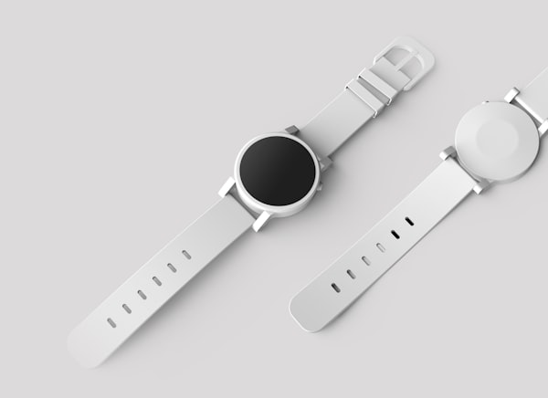

# មេរៀនទី ៤៤៖ Grid: Advanced Patterns & Auto Layouts

> **រូបមន្តមាស `repeat(auto-fit, minmax(250px, 1fr))` អនុញ្ញាតឱ្យយើងបង្កើត Responsive Grid ស្វ័យប្រវត្តិកម្រិតខ្ពស់ដោយមិនបាច់សរសេរ Media Queries សូម្បីតែមួយបន្ទាត់!**

---

## 🎯 គោលបំណងមេរៀន (What You Will Learn)
* យល់ដឹងពីអនុគមន៍ `minmax()` ក្នុង CSS Grid
* យល់ច្បាស់ពីភាពខុសគ្នារវាង **`auto-fit`** និង **`auto-fill`**
* ចេះបង្កើត Responsive Product Grid ដោយគ្មាន Media Queries

---

## 🚀 រូបមន្តមាស The Holy Grail Responsive Grid

```css
.responsive-grid {
  display: grid;
  grid-template-columns: repeat(auto-fit, minmax(280px, 1fr));
  gap: 20px;
}
```

### ការពន្យល់ដំណើរការកូដ (How it works):
1. **`minmax(280px, 1fr)`:** ក្រឡានីមួយៗមានទំហំយ៉ាងហោចណាស់ 280px (អប្បបរមា) និងអាចរីកពេញ 1fr នៃលំហដែលនៅសល់ (អតិបរមា)។
2. **`auto-fit`:** គណនាដោយស្វ័យប្រវត្តិនូវចំនួន Columns ដែលអាចញាត់ចូលក្នុងទំហំអេក្រង់បច្ចុប្បន្ន។
   * អេក្រង់ 1400px (Desktop) ➔ ចេញ **4 Columns**
   * អេក្រង់ 900px (Tablet) ➔ ចេញ **3 Columns**
   * អេក្រង់ 600px (Small Screen) ➔ ចេញ **2 Columns**
   * អេក្រង់ 360px (Mobile) ➔ ចេញ **1 Column**

👉 ទាំងអស់នេះដំណើរការដោយស្វ័យប្រវត្តិ 100% ត្រឹមតែ ១ បន្ទាត់!

---

## 🥊 ការប្រៀបធៀប៖ `auto-fit` ទល់នឹង `auto-fill`

នៅពេលដែលចំនួន Items មាន **តិចជាង** ចំនួន Columns សរុបដែលអាចផ្ទុកបាន៖
* **`auto-fit` (និយមប្រើបំផុត):** ក្រឡាដែលមាននឹង **ពង្រីករីកធំស្មើគ្នា** ដើម្បីបំពេញលំហជួរដេកឱ្យពេញ។
* **`auto-fill`:** បង្កើត **ក្រឡាទទេ (Empty phantom tracks)** រក្សាទំហំទុកនៅខាងស្តាំ ដោយមិនពង្រីក Items ឡើយ។

---

## 💻 ឧទាហរណ៍កូដជាក់ស្តែង (HTML + CSS)

```html
<!DOCTYPE html>
<html lang="en">
<head>
  <meta charset="UTF-8">
  <title>Auto-Fit Grid Demo</title>
  <style>
    body {
      font-family: Arial, sans-serif;
      padding: 30px;
      background-color: #f1f5f9;
    }

    .product-grid {
      display: grid;
      /* Zero Media Query Responsive Magic */
      grid-template-columns: repeat(auto-fit, minmax(240px, 1fr));
      gap: 20px;
      max-width: 1200px;
      margin: 0 auto;
    }

    .product-card {
      background: white;
      border: 1px solid #e2e8f0;
      border-radius: 10px;
      padding: 20px;
      text-align: center;
      box-shadow: 0 2px 6px rgba(0,0,0,0.04);
      transition: transform 0.2s, box-shadow 0.2s;
    }

    .product-card:hover {
      transform: translateY(-4px);
      box-shadow: 0 10px 20px rgba(0,0,0,0.08);
    }

    .product-img {
      width: 100%;
      height: 160px;
      object-fit: cover;
      border-radius: 6px;
      margin-bottom: 12px;
    }
  </style>
</head>
<body>

  <h2 style="text-align: center; margin-bottom: 25px;">បញ្ជីផលិតផល Responsive Grid</h2>

  <div class="product-grid">
    <div class="product-card">
      
      <h3>Laptop Pro</h3>
      <p>$1,200</p>
    </div>

    <div class="product-card">
      
      <h3>Smart Phone</h3>
      <p>$850</p>
    </div>

    <div class="product-card">
      
      <h3>Smart Watch</h3>
      <p>$299</p>
    </div>

    <div class="product-card">
      
      <h3>Tech Set</h3>
      <p>$150</p>
    </div>
  </div>

</body>
</html>
```

---

## ⚠️ ចំណុចគួរប្រយ័ត្ន & Best Practices (Common Pitfalls & Tips)
* ✅ **Best Practice:** ប្រើ `repeat(auto-fit, minmax(260px, 1fr))` ជានិច្ចសម្រាប់ E-commerce Product Catalogs, Blog Posts, និង Feature Cards។

---

## ✍️ លំហាត់អនុវត្តសាកល្បង (Mini Practice)
1. បង្កើត Grid Container ដោយប្រើរូបមន្ត `repeat(auto-fit, minmax(200px, 1fr))`។
2. សាកល្បងបង្រួញបង្អួច Browser ដើម្បីពិនិត្យមើលការផ្លាស់ប្តូរ Columns ដោយស្វ័យប្រវត្តិ។

---

<details>
<summary>📄 English Summary & Key Takeaways</summary>

* `minmax(min, max)` defines a size range greater than or equal to `min` and less than or equal to `max`.
* `repeat(auto-fit, minmax(250px, 1fr))` is the industry-standard pattern for creating responsive grids with zero media queries.
* `auto-fit` stretches existing items to fill the row, while `auto-fill` keeps empty columns open.
</details>

---

## 🧭 ការរុករកមេរៀន (Lesson Navigation)

| ⬅️ មេរៀនមុន (Previous) | 🏠 មាតិការួម (Table of Contents) | ➡️ មេរៀនបន្ទាប់ (Next) |
| :--- | :---: | ---: |
| [⬅️ មេរៀនទី ៤៣៖ Grid: Item Properties (CSS Grid Items)](43-grid-items.md) | [📚 មាតិកាទាំងអស់](../README.md) | [មេរៀនទី ៤៥៖ RWD: Viewport Meta Tag & Fluid Layouts ➡️](45-rwd-viewport.md) |
