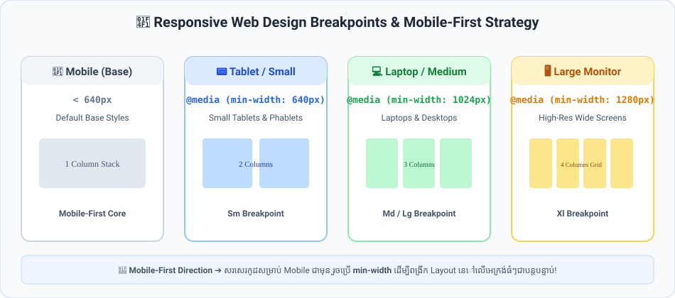

# មេរៀនទី ៤៦៖ RWD: Media Queries (CSS @media)

> **CSS Media Queries (`@media`) គឺជាបេះដូងនៃ Responsive Web Design ដែលអនុញ្ញាតឱ្យអនុវត្ត Style ផ្សេងៗគ្នាអាស្រ័យលើទំហំអេក្រង់ (Viewport Width) របស់ឧបករណ៍។**

---

## 🎯 គោលបំណងមេរៀន (What You Will Learn)
* យល់ដឹងពី Syntax នៃ `@media` rule
* ស្គាល់ **Standard Breakpoints** ពេញនិយមក្នុងឧស្សាហកម្ម Web Development
* ចេះប្រើ `min-width` និង `max-width` ក្នុង Media Queries

---

## 📱 Standard Breakpoints ពេញនិយម

<p align="center">
  
</p>

| ទំហំឧបករណ៍ (Device) | Breakpoint Range | Media Query (Mobile-First) |
| :--- | :--- | :--- |
| 📱 **Mobile (Base)** | `< 640px` | *(Default Styles គ្មាន Media Query)* |
| 📟 **Tablet (Small)** | `≥ 640px` | `@media (min-width: 640px) { ... }` |
| 💻 **Laptop (Medium)** | `≥ 1024px` | `@media (min-width: 1024px) { ... }` |
| 🖥️ **Desktop (Large)** | `≥ 1280px` | `@media (min-width: 1280px) { ... }` |

---

## ✍️ Syntax នៃ CSS Media Queries

```css
/* 1. Base Styles សម្រាប់ Mobile ជាមុន */
.sidebar {
  display: none; /* លាក់ Sidebar លើទូរស័ព្ទ */
}

.content {
  width: 100%;
}

/* 2. នៅលើ Tablet និង Laptop (អេក្រង់ចាប់ពី 768px ឡើងទៅ) */
@media screen and (min-width: 768px) {
  .layout-wrapper {
    display: flex;
  }

  .sidebar {
    display: block;
    width: 250px;
  }

  .content {
    flex: 1;
  }
}
```

---

## 💻 ឧទាហរណ៍កូដជាក់ស្តែង (HTML + CSS)

```html
<!DOCTYPE html>
<html lang="en">
<head>
  <meta charset="UTF-8">
  <meta name="viewport" content="width=device-width, initial-scale=1.0">
  <title>CSS Media Queries Demo</title>
  <style>
    * {
      box-sizing: border-box;
      margin: 0;
      padding: 0;
    }

    body {
      font-family: Arial, sans-serif;
      padding: 20px;
      background-color: #f1f5f9;
    }

    /* Mobile First: 1 Column Stack */
    .grid-container {
      display: flex;
      flex-direction: column;
      gap: 15px;
    }

    .box {
      background: white;
      padding: 20px;
      border-radius: 8px;
      border: 1px solid #cbd5e1;
      text-align: center;
    }

    /* Tablet: 2 Columns */
    @media (min-width: 640px) {
      .grid-container {
        flex-direction: row;
        flex-wrap: wrap;
      }
      .box {
        flex: 1 1 calc(50% - 15px);
      }
    }

    /* Desktop: 4 Columns */
    @media (min-width: 1024px) {
      .box {
        flex: 1 1 calc(25% - 15px);
      }
    }
  </style>
</head>
<body>

  <h2>Responsive Media Queries Demo</h2>
  <p style="margin-bottom: 20px;">សាកល្បងបង្រួញទំហំបង្អួច Browser ដើម្បីឃើញចំនួន Columns ផ្លាស់ប្តូរ (1 ➔ 2 ➔ 4 Columns)៖</p>

  <div class="grid-container">
    <div class="box">Box 1</div>
    <div class="box">Box 2</div>
    <div class="box">Box 3</div>
    <div class="box">Box 4</div>
  </div>

</body>
</html>
```

---

## ⚠️ ចំណុចគួរប្រយ័ត្ន & Best Practices (Common Pitfalls & Tips)
* ✅ **សរសេរតាមទម្រង់ Mobile-First (`min-width`):** គួរចាប់ផ្តើមសរសេរ Style សម្រាប់ Mobile ជាមុន រួចប្រើ `@media (min-width: ...)` ដើម្បីបន្ថែម Style សម្រាប់អេក្រង់ធំៗជាបន្តបន្ទាប់។
* ❌ **កុំបង្កើត Breakpoint ច្រើនពេក:** ជ្រើសរើសយក Breakpoints ស្តង់ដារ ៣ ទៅ ៤ គឺគ្រប់គ្រាន់ហើយ (កុំបង្កើត Breakpoint តាមម៉ូដែលទូរស័ព្ទនីមួយៗឡើយ)។

---

## ✍️ លំហាត់អនុវត្តសាកល្បង (Mini Practice)
1. បង្កើត Header Navigation មួយដែលមានពណ៌ផ្ទៃ `#2563eb` លើ Mobile។
2. ប្រើ `@media (min-width: 768px)` ដើម្បីប្តូរពណ៌ផ្ទៃទៅជា `#0f172a` នៅលើ Tablet/Desktop។

---

<details>
<summary>📄 English Summary & Key Takeaways</summary>

* Media queries allow CSS rules to be applied only under certain conditions (e.g., screen width).
* Mobile-first approach uses `min-width` queries to progressively enhance styles for larger screens.
* Common industry breakpoints: `640px` (sm), `768px` (md), `1024px` (lg), `1280px` (xl).
</details>
