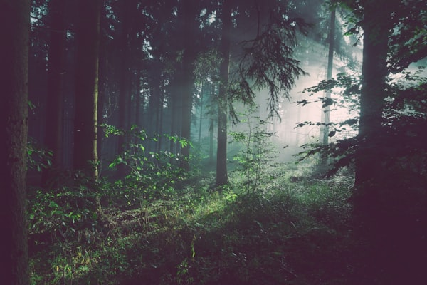

# មេរៀនទី ៥៧៖ តម្រងរូបភាព (CSS Filter Effects)

> **CSS `filter` ផ្តល់នូវមុខងារកែច្នៃពណ៌ និងផលប៉ះពាល់រូបភាព (ដូចក្នុង Photoshop) ដូចជា ធ្វើឱ្យព្រាល (`blur`), សខ្មៅ (`grayscale`), បង្កើនពន្លឺ (`brightness`) និងស្រមោល PNG (`drop-shadow`)។**

---

## 🎯 គោលបំណងមេរៀន (What You Will Learn)
* ស្គាល់គ្រប់អនុគមន៍ Filter ក្នុង CSS
* យល់ពីភាពខុសគ្នារវាង `box-shadow` និង `filter: drop-shadow()` លើរូបភាព PNG ថ្លា
* ចេះបង្កើត Hover Filter Effects លើរូបថត

---

## 🎨 អនុគមន៍ Filter ទាំង ៨ សំខាន់ៗ

```css
.filter-blur        { filter: blur(5px); }              /* ធ្វើឱ្យព្រាល */
.filter-grayscale   { filter: grayscale(100%); }        /* សខ្មៅ ១០០% */
.filter-brightness  { filter: brightness(150%); }       /* បង្កើនពន្លឺ ១.៥ ដង */
.filter-contrast    { filter: contrast(180%); }         /* បង្កើនកម្រិតកុងត្រាស */
.filter-sepia       { filter: sepia(80%); }             /* ពណ៌បុរាណបែប Classic */
.filter-hue-rotate  { filter: hue-rotate(90deg); }      /* បង្វិលពណ៌តាមកង់ពណ៌ */
.filter-invert      { filter: invert(100%); }           /* ប្តូរពណ៌បញ្ច្រាស (Negative) */
.filter-drop-shadow { filter: drop-shadow(4px 4px 10px rgba(0,0,0,0.5)); }
```

---

## 🌟 `box-shadow` ទល់នឹង `filter: drop-shadow()` (លើ PNG ថ្លា)

* **`box-shadow`:** បង្កើតស្រមោលរាងចតុកោណកែងជុំវិញ **ប្រអប់ក្រៅ** នៃរូបភាព។
* **`filter: drop-shadow()`:** ឆ្លាតវៃណាស់! វាបង្កើតស្រមោល **រត់តាមគែមពិតប្រាកដនៃរូបភាព PNG ឬ SVG ដែលមានផ្ទៃថ្លា**!

```css
/* ស្រមោលស្អាតតាមរាង Logo PNG */
.logo-transparent {
  filter: drop-shadow(0 8px 16px rgba(37, 99, 235, 0.4));
}
```


---

## 💻 ឧទាហរណ៍កូដជាក់ស្តែង (HTML + CSS)

```html
<!DOCTYPE html>
<html lang="en">
<head>
  <meta charset="UTF-8">
  <title>CSS Filters Demo</title>
  <style>
    body {
      font-family: Arial, sans-serif;
      padding: 30px;
      background-color: #f1f5f9;
    }

    .gallery {
      display: flex;
      gap: 20px;
      flex-wrap: wrap;
    }

    .img-card {
      width: 200px;
      height: 140px;
      object-fit: cover;
      border-radius: 8px;
      transition: filter 0.3s ease, transform 0.3s ease;
    }

    /* Grayscale to Color on Hover */
    .partner-logo {
      filter: grayscale(100%) opacity(70%);
    }

    .partner-logo:hover {
      filter: grayscale(0%) opacity(100%);
      transform: scale(1.05);
    }
  </style>
</head>
<body>

  <h2>Client Partner Logos (Hover to reveal color)</h2>

  <div class="gallery">
    
    
    
  </div>

</body>
</html>
```

---

## ⚠️ ចំណុចគួរប្រយ័ត្ន & Best Practices (Common Pitfalls & Tips)
* ✅ **Partner / Client Logos:** ការដាក់ `filter: grayscale(100%);` លើ Brand Logos ទាំងអស់ រួចដោះចេញពេល Hover គឺជាស្តង់ដារ UI Design ដ៏ពេញនិយមបំផុតដើម្បីកុំឱ្យពណ៌ Logo ចម្រុះរញ៉េរញ៉ៃលើគេហទំព័រ។

---

## ✍️ លំហាត់អនុវត្តសាកល្បង (Mini Practice)
1. បង្កើតរូបភាពមួយមាន `filter: grayscale(100%); transition: filter 0.3s;`។
2. ពេល `:hover` ឱ្យចេញពណ៌ធម្មជាតិវិញ (`filter: grayscale(0%);`)។

---

<details>
<summary>📄 English Summary & Key Takeaways</summary>

* The `filter` property adds visual effects (like blur and saturation) to an element.
* Functions include `blur()`, `brightness()`, `contrast()`, `grayscale()`, `hue-rotate()`, `invert()`, and `drop-shadow()`.
* `filter: drop-shadow()` fits the exact contours of transparent PNG and SVG assets.
</details>
