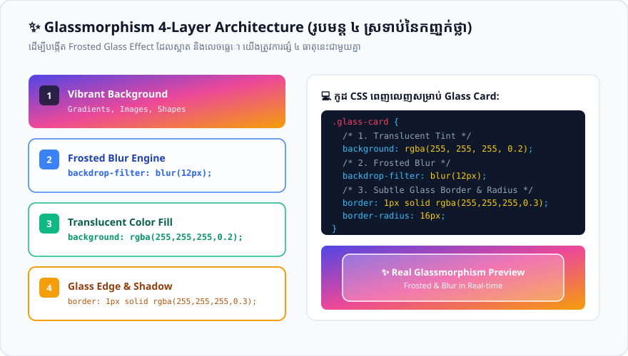

# មេរៀនទី ៥៨៖ Glassmorphism & Frosted Glass Effect

> **Glassmorphism គឺជាស្ទីលរចនា UI បែបកញ្ចក់ព្រាលទំនើប (Frosted Glass) ដូចនៅក្នុង iOS និង macOS ដោយប្រើប្រាស់ `backdrop-filter: blur(...)`។**

---

## 🎯 គោលបំណងមេរៀន (What You Will Learn)
* យល់ដឹងពី ៤ ធាតុផ្សំស្នូលក្នុងការបង្កើត **Glassmorphism UI**
* ចេះប្រើប្រាស់ `backdrop-filter: blur()`
* ចេះបង្កើត Modern Glass Card UI ជាមួយពន្លឺចាំងលើគែម Border

---

## 💎 ធាតុផ្សំទាំង ៤ នៃ Glassmorphism

<p align="center">
  
</p>

1. **Semi-transparent Background:** ផ្ទៃខាងក្រោយថ្លាស្រាល (ឧ. `background: rgba(255, 255, 255, 0.15);`)
2. **Backdrop Blur:** ធ្វើឱ្យផ្ទៃដែលនៅពីក្រោយខ្នងប្រអប់ព្រាល (ឧ. `backdrop-filter: blur(16px);`)
3. **Subtle Light Border:** បន្ទាត់ស៊ុមស្តើងពណ៌សថ្លាដូចកញ្ចក់ចាំងពន្លឺ (ឧ. `border: 1px solid rgba(255, 255, 255, 0.25);`)
4. **Soft Shadow:** ស្រមោលស្រាល (ឧ. `box-shadow: 0 8px 32px rgba(0, 0, 0, 0.2);`)

```css
.glass-card {
  background: rgba(255, 255, 255, 0.2);
  backdrop-filter: blur(12px);
  -webkit-backdrop-filter: blur(12px); /* សម្រាប់ Safari Support */
  border: 1px solid rgba(255, 255, 255, 0.3);
  border-radius: 16px;
  box-shadow: 0 8px 32px 0 rgba(31, 38, 135, 0.2);
}
```

---

## 💻 ឧទាហរណ៍កូដជាក់ស្តែង (HTML + CSS)

```html
<!DOCTYPE html>
<html lang="en">
<head>
  <meta charset="UTF-8">
  <title>CSS Glassmorphism Demo</title>
  <style>
    body {
      font-family: Arial, sans-serif;
      margin: 0;
      min-height: 100vh;
      display: flex;
      align-items: center;
      justify-content: center;
      /* Vibrant Mesh Background */
      background: radial-gradient(circle at top left, #4f46e5, #06b6d4, #ec4899);
    }

    .glass-card {
      width: 320px;
      padding: 30px;
      border-radius: 20px;
      background: rgba(255, 255, 255, 0.18);
      backdrop-filter: blur(16px);
      -webkit-backdrop-filter: blur(16px);
      border: 1px solid rgba(255, 255, 255, 0.35);
      box-shadow: 0 15px 35px rgba(0, 0, 0, 0.2);
      color: white;
      text-align: center;
    }

    .glass-btn {
      background: rgba(255, 255, 255, 0.3);
      color: white;
      border: 1px solid rgba(255, 255, 255, 0.5);
      padding: 10px 24px;
      border-radius: 50px;
      font-weight: bold;
      cursor: pointer;
      backdrop-filter: blur(8px);
      transition: background 0.3s;
    }

    .glass-btn:hover {
      background: rgba(255, 255, 255, 0.5);
    }
  </style>
</head>
<body>

  <div class="glass-card">
    <h2>✨ Glass UI</h2>
    <p>ផ្ទៃកញ្ចក់ថ្លាឆ្លុះមើលធ្លុះផ្ទៃ Background ខាងក្រោយយ៉ាងស្រស់ស្អាត។</p>
    <button class="glass-btn">Get Started</button>
  </div>

</body>
</html>
```

---

## ⚠️ ចំណុចគួរប្រយ័ត្ន & Best Practices (Common Pitfalls & Tips)
* ✅ **`-webkit-backdrop-filter`:** ត្រូវសរសេរ Prefix `-webkit-backdrop-filter: blur(12px);` ជាមួយគ្នាជានិច្ច ដើម្បីធានាដំណើរការ 100% លើ Apple Safari និង iOS Devices។
* ✅ **ត្រូវការ Background ចម្រុះពណ៌:** Glassmorphism នឹងលេចធ្លោស្អាតលុះត្រាតែផ្ទៃ Background ខាងក្រោយមានពណ៌ ឬរូបភាពរស់រវើក។

---

## ✍️ លំហាត់អនុវត្តសាកល្បង (Mini Practice)
1. បង្កើត Glass Navbar មួយដែលមាន `backdrop-filter: blur(10px); background: rgba(15, 23, 42, 0.6);` ជាប់នៅផ្នែកខាងលើទំព័រ (Sticky Top)។

---

<details>
<summary>📄 English Summary & Key Takeaways</summary>

* Glassmorphism relies on semi-transparent backgrounds and blurred backdrops (`backdrop-filter: blur()`).
* Always include the `-webkit-backdrop-filter` prefix for Safari browser support.
* Light borders (`rgba(255,255,255,0.3)`) simulate real glass edges reflecting light.
</details>
